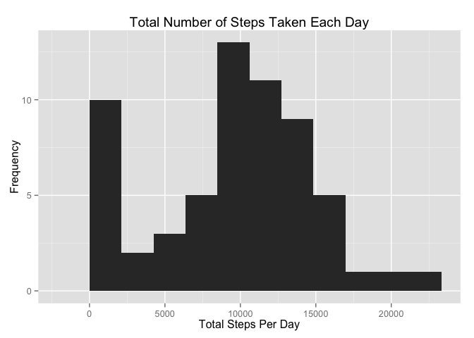
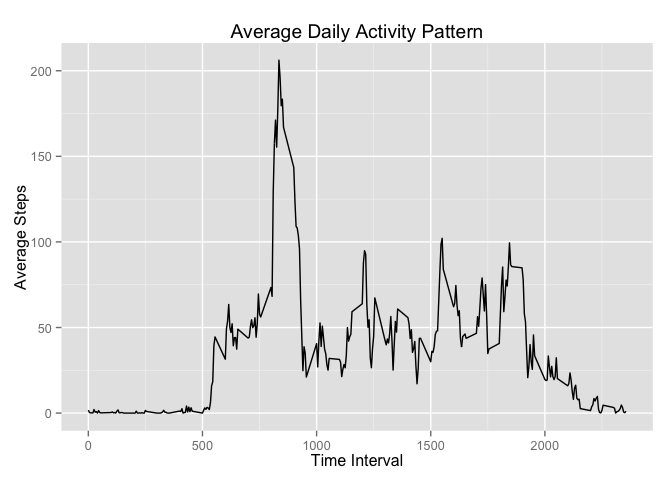
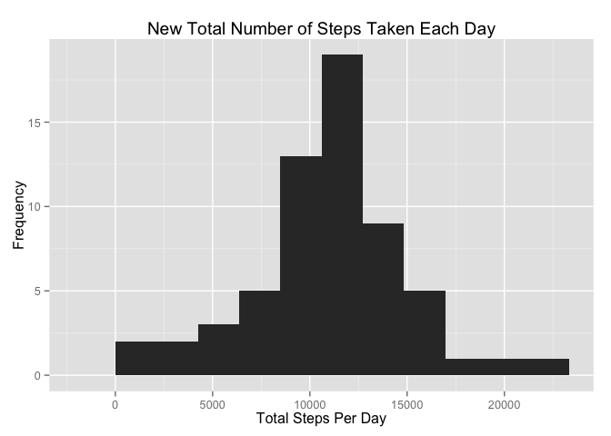
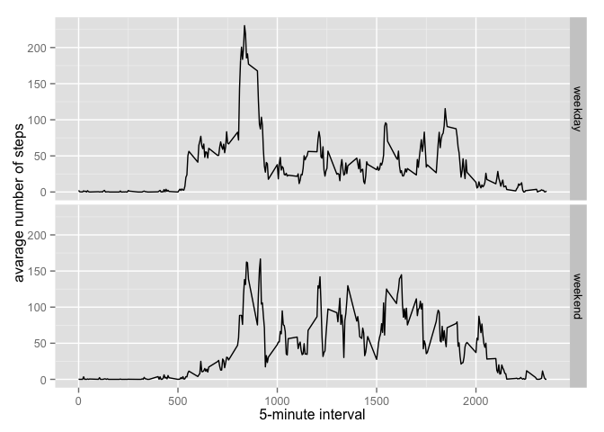

# Reproducible Research: Peer Assessment 1

## Loading and preprocessing the data

```r
data <- read.csv("activity.csv", header = TRUE, sep = ",")
```


## What is mean total number of steps taken per day?

```r
library(ggplot2)
daysteps <- tapply(data$steps, data$date, sum, na.rm = TRUE)
qplot(daysteps, binwidth = max(daysteps/10), xlab = "Total Steps Per Day",
      ylab = "Frequency", main = "Total Number of Steps Taken Each Day")
```

 

```r
meandaysteps <- mean(daysteps)
mediandaysteps <- median(daysteps)
```
The mean total number of steps taken per day is 9354.23.
The median total number of steps taken per day is 10395.

## What is the average daily activity pattern?
Make a time series plot (i.e. type = "l") of the 5-minute interval (x-axis) and the average number of steps taken, averaged across all days (y-axis)

```r
# calculate the average number of steps taken for each 5-minute interval
avgsteps <- aggregate(list(steps = data$steps), list(interval = data$interval), mean, na.rm = TRUE)
# create a time series plot of interval vs avg steps
ggplot(avgsteps, aes(interval, steps)) + geom_line() + xlab("Time Interval") + ylab("Average Steps") + ggtitle("Average Daily Activity Pattern")
```

 

Which 5-minute interval, on average across all the days in the dataset, contains the maximum number of steps?

```r
# find the 5-minute interval that contains the maximum number of steps
maxinterval <- avgsteps[which(avgsteps$steps == max(avgsteps$steps)), 1]
```
The 835th interval contains the maximum number of steps.

## Imputing missing values
Calculate and report the total number of missing values in the dataset (i.e. the total number of rows with NAs)

```r
# total number of missing values in the dataset
nummissing <- sum(is.na(data$steps))
```
Devise a strategy for filling in all of the missing values in the dataset.

We will replace the missing values with the mean of steps taken across all days for the corresponding time intervals.

Create a new dataset that is equal to the original dataset but with the missing data filled in.

New data set newdata is created by copying data first, and then replacing the values with the corresponding interval averages.

```r
# create new dataframe by copying original
newdata <- data

# find indicies of the NA values in original dataset
missingvalue <- which(is.na(data$steps))

# replace the NA values with the corresponding interval averages
newdata$steps[missingvalue] = rep(avgsteps$steps, 288)[missingvalue]
```
Make a histogram of the total number of steps taken each day and Calculate and report the mean and median total number of steps taken per day. Do these values differ from the estimates from the first part of the assignment? What is the impact of imputing missing data on the estimates of the total daily number of steps?

Histogram of the total number of steps taken each day from new dataset

```r
# calculate the total number of steps taken each day
newdaysteps <- tapply(newdata$steps, newdata$date, sum)

# create a histogram with 10 bins
qplot(newdaysteps, binwidth = max(newdaysteps/10), xlab = "Total Steps Per Day", ylab = "Frequency", main = "New Total Number of Steps Taken Each Day")
```

 


```r
# Calculate the mean and median
newmeandaysteps <- format(mean(newdaysteps), scientific = FALSE)
newmediandaysteps <- format(median(newdaysteps), scientific = FALSE)
```
The new mean total number of steps taken per day is 10766.19, whereas the previous mean was 9354.23.
The new median total number of steps taken per day is 10766.19, whereas the previous median was 10395.

Imputing the missing values resulted in the estmates of the total number of steps to be larger than than previously calculated. This is a reasonable result, since previously the missing datapoints were disregarded completely. Adding these results back in will increase the mean and median regardless of magnitude.

## Are there differences in activity patterns between weekdays and weekends?
Create a new factor variable in the dataset with two levels -- "weekday" and "weekend" indicating whether a given date is a weekday or weekend day.

```r
newdata$datetype <-  ifelse(as.POSIXlt(newdata$date)$wday %in% c(0,6), 'weekend', 'weekday')
```
Make a panel plot containing a time series plot of the 5-minute interval (x-axis) and the average number of steps taken, averaged across all weekday days or weekend days (y-axis).

```r
averagednewdata <- aggregate(steps ~ interval + datetype, data=newdata, mean)
ggplot(averagednewdata, aes(interval, steps)) + 
    geom_line() + 
    facet_grid(datetype ~ .) +
    xlab("5-minute interval") + 
    ylab("avarage number of steps")
```

 

There are slight differences in the daily activity patterns between weekdays and weekends on average:

the number of steps recorded during the earlier part of the day (from 5:00 to 9:00) is substantially higher on weekdays than weekends
step activity tends to be slightly higher on weekends during the middle parts of the day (from 10:00 to 18:00)
step activity drops to inactive/low level bit later on weekends (around 21:00) than on weekdays (around 20:00)
